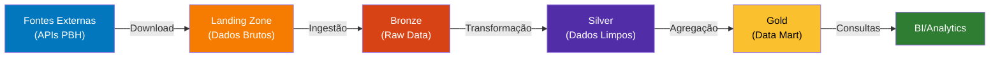
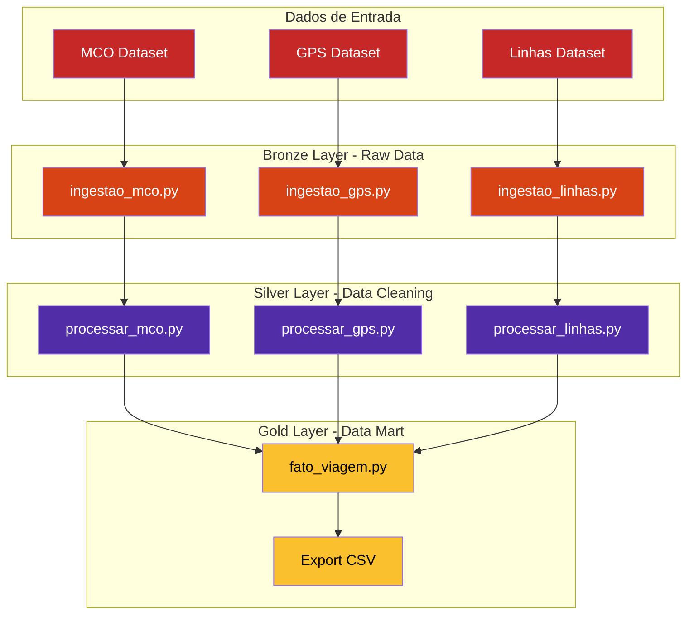

# Projeto Dados PL - Pipeline de Mobilidade Urbana

Solução de ETL completa para processamento de dados públicos de mobilidade urbana de Belo Horizonte. O pipeline extrai dados do Portal de Dados Abertos (PBH), realiza transformações estruturadas e carrega em um data warehouse, seguindo a arquitetura Medallion com boas práticas de governança, qualidade e teste de dados.

## Objetivo do Projeto

Este projeto implementa um pipeline de dados automatizado que:

- **Extrai** dados públicos de mobilidade urbana do Portal de Dados Abertos de Belo Horizonte
- **Armazena** em um data lake estruturado seguindo a arquitetura Medallion
- **Transforma** dados em múltiplas camadas (Bronze → Silver → Gold)
- **Carrega** em tabelas analíticas prontas para BI e Machine Learning
- **Valida** qualidade dos dados em todas as camadas
- **Documenta** mudanças e decisões técnicas

## Fonte de Dados

Os dados são obtidos do **Portal de Dados Abertos de Belo Horizonte**:

- **MCO (Mapa de Controle Operacional)**: Status operacional das linhas de ônibus em tempo real
- **GPS**: Posicionamento geográfico em tempo real dos veículos de transporte público
- **Linhas**: Cadastro das linhas de ônibus com informações de trajeto e operação

**Endpoint Base**: [dados.pbh.gov.br](https://dados.pbh.gov.br/)

---

## Arquitetura da Solução

### Diagrama da Arquitetura do Data Lake



### Diagrama Estrutural do Fluxo ETL



## Estrutura de Diretórios

```
projeto-dados-pl/
├── README.md                         # Este arquivo
├── requirements.txt                  # Dependências Python
├── main.py                           # Ponto de entrada do pipeline
│
├── src/                              # Código-fonte
│   ├── config.py                     # Configurações globais (URLs, caminhos)
│   ├── spark_session.py              # Inicialização e configuração Spark
│   ├── utils/                        # Utilitários reutilizáveis
│   │   ├── download.py               # Download de dados das APIs
│   │   ├── quality.py                # Validações e checagens de qualidade
│   │   └── save.py                   # Escrita em Delta Lake / Parquet
│   │
│   └── etl/                          # Orquestração do pipeline
│       ├── ingestao_bronze.py        # Orquestrador da camada Bronze
│       ├── ingestao_silver.py        # Orquestrador da camada Silver
│       ├── ingestao_gold.py          # Orquestrador da camada Gold
│       │
│       ├── bronze/                   # Ingestão de dados brutos
│       │   ├── ingestao_gps.py
│       │   ├── ingestao_linhas.py
│       │   └── ingestao_mco.py
│       │
│       ├── silver/                   # Transformação e limpeza
│       │   ├── processar_gps.py
│       │   ├── processar_linhas.py
│       │   └── processar_mco.py
│       │
│       └── gold/                     # Agregações e data marts
│           └── fato_viagem.py
│
├── data/                             # Data Lake (não incluído no Git)
│   ├── bronze/                       # Dados brutos em Parquet
│   │   ├── gps/
│   │   ├── linhas/
│   │   └── mco/
│   ├── silver/                       # Dados transformados em Delta Lake
│   │   ├── gps/
│   │   ├── linhas/
│   │   └── mco/
│   └── gold/                         # Data Marts em Delta Lake
│       ├── fato_performance_diaria/
│       └── fato_performance_diaria_csv/
│
├── dicionario/                       # Documentação de dados
│   ├── Tabela GPS.md                 # Dicionário da tabela GPS
│   ├── Tabela MCO.md                 # Dicionário da tabela MCO
│   └── Tabela Fato.md                # Dicionário da tabela Fato (Gold)
│
└── tests/                            # Testes automatizados
    ├── conftest.py                   # Fixtures e configurações Pytest
    └── test_quality.py               # Testes de validação de dados
```

---

## Uso e Execução

### Executar o Pipeline Completo

```bash
python main.py
```

### Executar Testes

```bash
# Todos os testes
pytest tests/ -v
```

---

## Fluxo de Dados e Processamento

### Etapa 1: Bronze - Ingestão
```
APIs PBH → Download → Parquet (Bronze)
```
- Download de dados via APIs públicas
- Armazenamento imutável em Parquet
- Sem transformações

### Etapa 2: Silver - Transformação
```
Parquet (Bronze) → Limpeza e Padronização → Delta Lake (Silver)
```
- Remoção de duplicatas
- Tratamento de nulos
- Validação de tipos e ranges
- Padronização de formatos

### Etapa 3: Gold - Agregação
```
Delta Lake (Silver) → Joins e Agregações → Delta Lake (Gold)
```
- Criação de fatos e dimensões
- Cálculo de métricas
- Exportação para BI/Analytics

---

## Documentação Complementar

Consulte os seguintes documentos para mais informações:

- **[Tabela GPS](./dicionario/Tabela%20GPS.md)** - Definições de campos e transformações
- **[Tabela MCO](./dicionario/Tabela%20MCO.md)** - Estrutura e lógica operacional
- **[Tabela Fato](./dicionario/Tabela%20Fato.md)** - Métricas de negócio na camada Gold

---